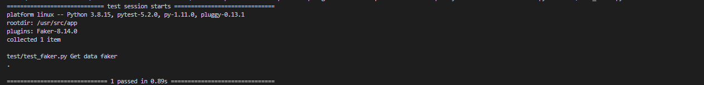

# Iniciar el proyecto
    - docker-compose build
    - docker-compose up

Luego de que los contenedores esten arriba , se puede validar si todos se subieron de la manera correcta usando:
    - docker ps

# Docker

Puertos habilitados para los contenedores:

    - 5000 -> El objetivo del contenedor que esta en este puerto es por medio de los botones consumir las apis que se crearon en el contenedor de api-service.

    - 5001 -> El unico objetivo del contenedor que se encuentra en este puerto es responder las solicitudes que le envia la app de la web.

    - 5002 -> El unico objetivo del contenedor que se encuentra en este puerto es generar 13 datos aleatorios los cuales son (nombre,nombre_compania,ciudad,direccion,telefono) , se puede validar si el contenedor esta funcionando es realizando el proceso por postman (El unico metodo que recibe esta api es de tipo GET ) http://localhost:5002/datos

# Interfaz web

La interfaz web se encuentra en el puerto 5000 solo se debe de entrar (http://localhost:5000/)

Crear registros

# Pgadmin

- Pgadmin se encuentra en el puerto 80 (http://localhost:80)

Las credenciales para entrar se encuentran en el archivo pgadmin.env
PGADMIN_DEFAULT_EMAIL=root@root.com
PGADMIN_DEFAULT_PASSWORD=root

Para ver la base de datos se debe de dar click derecho al server y registrar un server , las credenciales son las siguientes

Name : Puede ser cualquier nombre que deseen poner al server (postgres_database)

Connection:
    - Host : db
    - port: 5432
    - username: hello_flask
    - password: hello_flask
    - maintenance database : hello_flask_dev

# Correr test

- Para correr los test el proyecto debe de estar corriendo
docker-compose -f docker-compose.yml exec -T faker-service pytest test/test_faker.py -s

docker-compose -f docker-compose.yml exec -T api-service pytest test/test_api.py -s

# El gestor de depedencias que se usa es pip el cual es el encargado de instalar todos los paquetes necesarios para cada proyecto

# Verificador de codigo se encuentra en la carpeta .vscode en settings.json , se usa flake8.